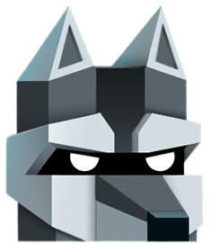

<!-- PROJECT LOGO -->
 

  

  <h1 align="center">Will Hero Game - JavaFX </h1>

  

    An awesome game to try out !
     

<!-- TABLE OF CONTENTS -->

  
Table of Contents

  <ol>
    <li>
      <a href="#about-the-project">About The Project</a>
      <ul>
        <li><a href="#built-with">Built With</a></li>
      </ul>
    </li>
    <li>
      <a href="#getting-started">Getting Started</a>
      <ul>
        <li><a href="#prerequisites">Prerequisites</a></li>
      </ul>
    </li>
    <li><a href="#roadmap">Roadmap</a></li>
    <li><a href="#contact">Contact</a></li>
    <li><a href="#acknowledgements">Acknowledgements</a></li>
  </ol>

<!-- ABOUT THE PROJECT -->
## About The Project

 
This is clone of popular Will Hero game developed using Java FX module and OOPS concepts !
 

#### Some Key Features of the game 

- Implemented gravity and collision effects between orcs and hero or between two orcs.
- Multiple Weapons and their upgrades
- Multiple obstacles, rewards and game tracks.
- Revive and Multiple Checkpoints in a game.
- Save games and checkpoints and re-load them back and continue from where you left. (Serialisation - Deserialisation)
- Highscores & Fluid animations.

- For more details refer `AP Project 2021.pdf `

### Built With

* [Java](https://www.java.com/en/)
* [JavaFX](https://openjfx.io/)
* [SceneBuilder](https://gluonhq.com/products/scene-builder/)
* [GitHub](https://github.com)

<!---
### Gallery

--->

### Youtube Demo 

https://www.youtube.com/watch?v=0pEfi0UgHiQ

<!-- GETTING STARTED -->
## Getting Started

To get a local copy up and running follow these simple steps.

### Prerequisites

1. Basic understanding of Java (Tutorials: [English ](https://youtu.be/8cm1x4bC610)| [Hindi](https://youtu.be/rV_3Lewxx6o))
2. Java installed on your computer ([Download from Here](https://openjfx.io/openjfx-docs/#install-java))
3. JavaFX installed on your computer ([Download from Here](https://gluonhq.com/products/javafx/))
4. IntelliJ IDEA installed on your computer ([Download from Here](https://www.jetbrains.com/idea/download/))
5. GitHub Account ([Sign Up](https://github.com))

<!-- ROADMAP -->
## Roadmap

Clone the repo and open it in `IntelliJ IDEA` IDE for complete project backend code. You can also fix the issues and hence contribute.

<!-- CONTACT -->
## Contact

- Mohit Jain - mohit20221@iiitd.ac.in
- Sanyam Goyal - sanyam20116@iiitd.ac.in

<!-- MARKDOWN LINKS & IMAGES -->
[product-screenshot]: readme-images/ss.png
